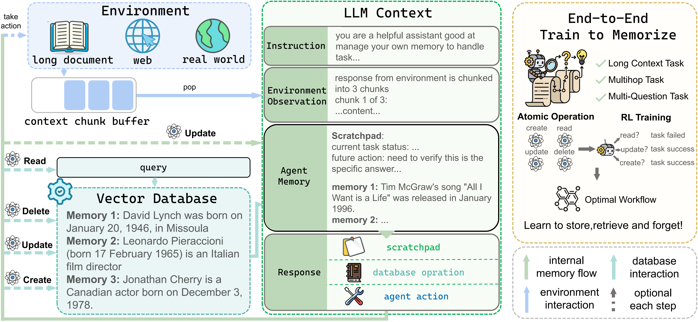

# AtomMem : Learnable Dynamic Agentic Memory with Atomic Memory Operation
> This repo is the official code implementation of **AtomMem : Learnable Dynamic Agentic Memory with Atomic Memory Operation** <br>
<!-- > [[arXiv]](https://arxiv.org/abs/2601.08323) <br> -->

[](./LICENSE)
[](https://www.python.org/)

⭐️ Please star this repository if you find it helpful!

## Overview

We introduce **AtomMem**, a dynamic memory framework that reframes memory management as a learnable decision-making problem. Instead of relying on predefined pipelines, AtomMem decomposes memory manipulation into **atomic CRUD operations**—Create, Read, Update, and Delete—and trains the agent to decide when and how to invoke these operations based on task context.

## Quick Start
### Environment Preparation 

#### clone repository
```
git clone (The URL has been anonymized.)
cd AtomMem
```

#### install dependencies
```
pip install -r requirements.txt
```

### Data Preparation

**1.** download the dataset in our paper(or prepare your own dataset):

[[HotpotQA]](https://huggingface.co/datasets/hotpotqa/hotpot_qa) [[2WikiMultiHopQA]](https://github.com/Alab-NII/2wikimultihop) [[Musique]](https://github.com/stonybrooknlp/musique)

Place the dataset under the **taskutils/memory_data** directory, organized in the following structure:
```
- taskutils
  |- memory_data
    |- hotpotqa_train.json
    |- hotpotqa_dev.json
```
**2.** run the following command of specific dataset.
```
./AtomMem/taskutils/script/HotpotQA.sh
./AtomMem/taskutils/script/2Wiki.sh
./AtomMem/taskutils/script/Musique.sh
```

### Inference

**1.** download our model from huggingface or modelscope
```
(The URL has been anonymized.)
```

**2.** start the vllm service on port 8001
```
vllm serve your_model_path --served_model_name AtomMem --port 8001
```

**3.** run the following script to inference on our tasks
```

```